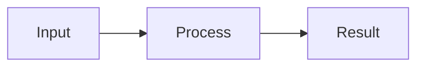

# Optional Concept Diagrams

Load this reference only when a diagram adds value. Default to no diagram.
Use one small Mermaid diagram only when relationships,
sequence, or a decision become clearer than prose. Prefer roughly three to
seven elements, not a picture of every procedural step.

- QA: distinguish concepts or component relationships.
- How-to: show the overall flow before actions.
- Break-fix: show a decisive branch or expected-versus-failing path.

These are authored illustrations, not screenshots or additional evidence.
Ground every label, arrow, branch, and order in inspected sources; use generic
de-identified labels. Mark hypotheses explicitly or omit them. Never turn an
unverified causal theory into a confirmed architecture diagram.

Put the diagram inside an existing relevant section before References.
Immediately follow it with a short `Diagram:` caption and inline source
citations or attributed session excerpts. Support substantive relationships in
the article itself, not a separate evidence file.
A single caption citation does not automatically support every arrow.
Keep essential safety conditions in text, not hidden inside a diagram.

The following is a syntax illustration, not sourced evidence:

````markdown

Diagram: <Explain the supported relationship and cite its sources.>
````

Use a simple `flowchart`, `graph`, or `sequenceDiagram`. No click handlers,
embedded HTML, URLs, renderer configuration/init directives, styling directives,
or security-setting changes. Never upload labels or source material to online
diagram editors/renderers.

This document-only edition does not generate SVG or other external image assets.
If Mermaid is unsupported, use a plain-text explanation or a small Markdown
table instead. Do not reconstruct the former SVG validator or silently fetch
a remote image as a fallback.

Review the rendered result only in an available trusted local viewer. If none
is available, report rendering as unverified; source inspection alone does not
prove successful rendering. The usual privacy, claim, and independent-review
checks apply to the complete diagram. Any edit requires renewed review.
