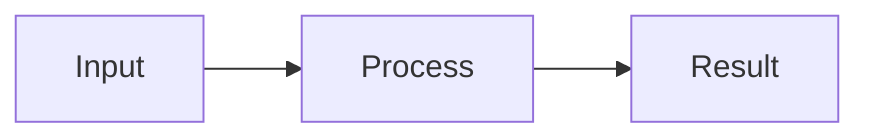

# Optional Concept Diagrams

## When to draw

Default to no diagram for a straightforward article. Add one small conceptual
diagram only when it communicates a relationship, sequence, or decision more
clearly than the text. Prefer roughly three to seven elements, not a picture of
every procedural step. Do not add a mandatory Diagram heading or repeat prose.

- QA: distinguish related concepts or show component relationships.
- How-to: show the overall flow before the actions.
- Break-fix: show a small decision tree or expected-versus-failing path.

Use Mermaid by default. Use a static SVG when an actual image is requested, the
target viewer does not support Mermaid, or a custom layout genuinely helps.
Do not create both formats unnecessarily.

## Evidence and caption

These are authored illustrations, not observed screenshots or additional proof.
Ground labels, arrows, and ordering in the selected evidence. Use generic,
de-identified labels, not customer topology or real resource identifiers.

Immediately after the diagram, add one short caption:

```text
Diagram: <A specific supported explanation of what the diagram shows.> [S1](#s1)
```

Map the caption's substantive claims to source IDs in the evidence companion.
The cited originals stay in the article's compact References. A caption citation
does not automatically substantiate every arrow; semantic review must check
the entire diagram. Mark a hypothesis explicitly, or omit it; never draw an
unverified cause as an established cause.

Place the diagram within an existing relevant content section, before References.
Keep material safety conditions in the opening text, not hidden in an image.
Meaningful uncertainty can also be listed in the final Double-check section.

## Mermaid

Use a fenced `mermaid` block containing a simple `flowchart`, `graph`, or
`sequenceDiagram`. For example, the following is a generic syntax illustration,
not a sourced article to copy as evidence:

````markdown

Diagram: <Explain the supported relationship and cite its source.>
````

No click handlers, embedded HTML, external URLs, renderer configuration/init
directives, or styling directives. Do not weaken renderer security settings.
The validator checks the supported shape and unsafe constructs, not complete
Mermaid grammar or whether a viewer actually rendered it.

Mermaid text is already covered by the article hash. Review the rendered result
when a suitable local viewer is available; otherwise report rendering as unverified.
Do not upload private labels or source material to online diagram editors.

## SVG fallback

Create an original UTF-8 SVG beside the article in the same run/batch directory.
Use a simple filename such as `concept.svg`, nonempty alt text, and a Markdown
image link to that local file. Put the cited Diagram caption immediately below.
Never fetch a remote image as a substitute for drawing the concept.

Use only static SVG shapes/text/groups, a viewBox, a descriptive title, and
presentation attributes. No scripts, event attributes, external resources,
CSS/style elements, foreignObject, animation, DTDs, or entities. Internal marker
references such as `url(#arrow)` are allowed only for defined IDs.

The validator permits svg, g, rect, circle, ellipse, line, polyline, polygon,
path, text, tspan, title, desc, defs, and marker elements in the SVG namespace.
It limits SVGs to 100,000 characters and 512 elements. Attribute allowlisting
is deliberately narrow; keep drawings simple rather than bypassing validation.

Save the asset before linking to it. Keep existing assets untouched and use a
new name if needed. Pass every SVG explicitly to the validator:

```text
python -B tools\validate_wiki.py --article <absolute-wiki-path> --evidence <absolute-evidence-path> --svg <absolute-svg-path>
```

Repeat `--svg` for multiple declared assets; at most 32 are supported per batch.
All assets must be referenced, local, same-directory, and not symlinks/reparse
files. Undeclared/remote images and other image formats are rejected.

## Review and delivery

SVGs are additional reviewed content, not just decoration. When SVGs are present,
the separate review attestation must include a top-level `assets` array of
`{"file": "concept.svg", "sha256": "<actual hash>"}` records covering every asset.
The validator reports asset hashes and rejects stale/missing review hashes.
Without SVGs, retain the existing attestation shape with no assets field.

The validator scans SVG text/attributes after XML decoding as well as raw files.
This is not a complete privacy, rendering, or factual-safety guarantee.

Keep the usual local-save behavior: no console previews or routine save prompts.
Return the Wiki's full paths and links, listing any SVG asset paths separately.
Do not print the diagram source, SVG body, or article to the console.
